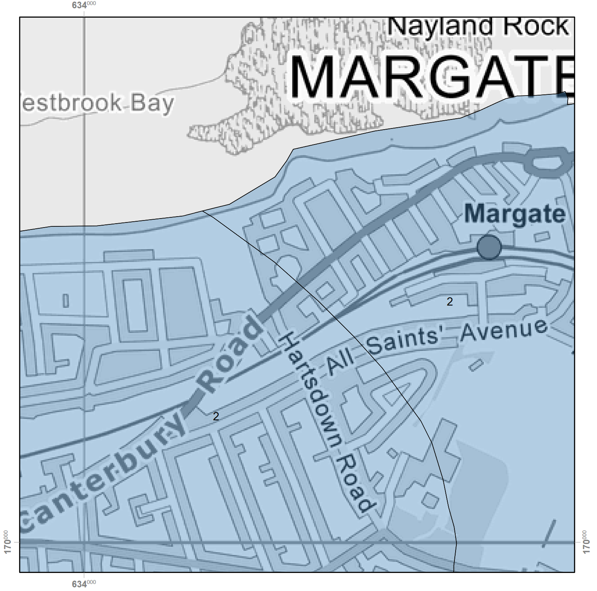

---
title: "Site investigation"
---

## Hours in Sunlight

A sunlight analysis was generated in r.grass using the sun python library and digital terrain map (DTM) of the area. The DTM was derived from lidar point cloud data, freely accessible by Defra's National Lidar Programme. 

## Results

The site at 43 Rancorn receives somewhere between x and y hours of sunlight annually, generating x kw/hr

In the longest day of the year it captures between x and y hours of sunlight. The east side receiving as much as x% more than the west wall, opposite. 

A site that receives  six to eight hours a day of direct sunlight in mid-summer is classified as 'full-sun' 
![[Group 2 1.png]]
Due to it's northern positioning, the amount of sunlight falls perceptably in autumn. I'm concerned what this will do to an autumn flowering. 
## Conclusion 
Passive irrigation should be used to increase the site's hydration. Planting style, draught tolerant planting resiliant to alkaline and chalky conditions.    

# Soil 

Diagram of bedrock through to topsoil. 

## Parent Soil

Along with the effects of climate, relief, organisms and time, the underlying geology or 'parent
material' has a very strong influence on the development of the soils of England and Wales.
Through weathering, rocks contribute inorganic mineral grains to the soils and thus exhibit
control on the soil texture. During the course of the creation of the national soil map, soil
surveyors noted the parent material underlying each soil in England and Wales. It is these
general descriptions of the regional geology which is provided in this map.

## Topsoil Texture 

This map indicates the soil texture group of the upper 30 cm of the
soil. Loamy soils have a mix of sand, silt and clay-sized particles and are intermediate in
character.

## Hydrology 
1. Unconsolidated: This refers to soil or sediment that is loose and not cemented together into solid rock. In your garden, this would mean the soil and material are relatively soft and can be easily dug up or moved around. This can affect drainage and root growth, as water can move more freely through it than through hard, consolidated rock.
    
2. **Microporous**: This describes the structure of the soil or rock, indicating that it has very small pores or spaces between particles. Micropores hold water tightly, which means water may not flow through as quickly but can be retained, providing moisture to plants over time. However, if the pores are too fine, it might limit drainage.
    
3. **By-pass flow common**: This term means that water often moves quickly through larger cracks, channels, or pathways, bypassing the smaller pores. Instead of soaking into the soil uniformly, water can rush through specific routes. In a garden, this could mean that during heavy rain, water might not evenly distribute across the soil but instead move rapidly down through certain areas, potentially missing some plant roots.
    
4. **Rock hydrology**: This is about how water interacts with the rock or soil. Different types of rock have different capacities for holding and moving water, and this affects groundwater flow and availability.
    
5. **Chalky drift and coverloam**:
    
    - **Chalky drift** indicates deposits that have a chalky, calcium-rich content, often laid down by glaciers or other historical processes. This kind of soil can be alkaline, affecting the types of plants that thrive in your garden.
    - **Coverloam** is a type of soil that sits over these deposits, usually consisting of finer particles like silt, clay, and sand. Loam is generally good for gardening because it holds nutrients and moisture well while still providing adequate drainage.

## Implications for your garden and soil

- Water retention could be variable: While there may be good water-holding capacity in smaller pores, rapid drainage through bypass routes could lead to uneven moisture distribution.
- The chalky nature of the soil could make it more alkaline, which might limit the growth of certain plants that prefer acidic soils.